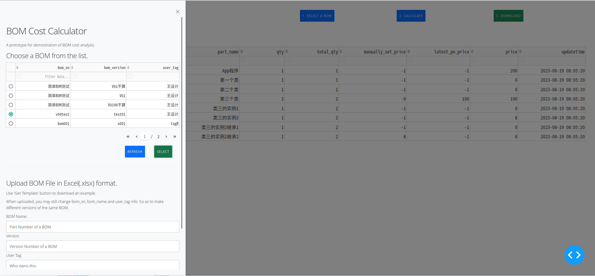

# bom_dev

## Name
It's a simple web app build with Dash from plotly.  The name jsut came to my mind.
There will be other functions added to this project.

## Purpose
1. Learn how to build a webapp with pure python.
2. Calculate the purchase cost of a bom part. Used to made it with SQL stored procedure in postgres and SQL server. Time to make a python version and make it a compact solution.
3. To identify if me can be a coder.

## Log
Simple version here, for more details, click 'dev_log'.

## Current Version  v0.6 /v0.6_R
### How to use
- Click "select bom" button to upload or choose a bom file. Template provided.
- Load the bom you need. (bom_sn = the name or part number of a part; bom_name = part name; user_tag = for sharing the app with multiple users)
- The 'manual price' column can accpet new value(manually set price) to override the price from po history table. (double click, fill in your number, press 'enter')
- Click 'Calculate' button to recalculate the total cost of a bom
- Click 'Download' button to download the list in Excel format.
### Differenceof 'R'
There are Chinese names in UI of v0.6_R. 
PS: I will remove all the Chinese comments later.

### Basic setups
- Both postgres(>12) and SQL server(> 2012) are OK. Change it in the head of script file.
- Create tables. Install required python libs. Edit the script according to your environment.

#### Required lib

~~~ bash
pip isntall pandas sqlalchemy pymssql dash psycopg2-binary dash-bootstrap-components openpyxl
~~~

#### SQL to create tables

For postgres users，create schema named “bom_dev”；
For SQLServer users， create a database names “bom_dev”;

And you need to do nessesary editings in script.

**For Chinese support, Please do set Colation to “Chinese_PRC_CI_AS”**

~~~ SQL
/* for Postgresql*/
CREATE TABLE bom_dev.bom_export (
	bom_sn varchar(100) NOT NULL,
	bom_version varchar(100) NOT NULL,
	layer_sn varchar(100) NOT NULL,
	part_number varchar(100) NOT NULL,
	part_name varchar(100) NOT NULL,
	qty numeric(10, 2) NOT NULL,
	total_qty numeric(10, 2) NOT NULL,
	user_tag varchar(100) NULL,
	record_date varchar(100) NULL
);

CREATE TABLE bom_dev.manualprice (
	part_number varchar(100) NULL,
	part_name varchar(100) NULL,
	manualprice numeric(10, 2) NULL,
	bom_sn varchar(100) NULL,
	bom_version varchar(100) NULL,
	user_tag varchar(100) NULL,
	record_time varchar(100) NULL
);

CREATE TABLE bom_dev.po_history (
	po_number varchar(100) NULL,
	part_number varchar(100) NULL,
	part_name varchar(100) NULL,
	price numeric(10, 2) NULL,
	batch_qty numeric(10,2) NULL,
	po_date varchar(50) NULL
);

CREATE TABLE bom_dev.stdprice (
	part_number varchar(100) NULL,
	part_name varchar(100) NULL,
	stdprice numeric(10,2) NULL
);

/* for SQL Server*/
-- DEFAULT Colation is Chinese_PRC_CI_AS

CREATE TABLE bom_dev.dbo.bom_export (
	bom_sn nvarchar(100) NOT NULL,
	bom_version nvarchar(100) NOT NULL,
	layer_sn nvarchar(100) NOT NULL,
	part_number nvarchar(100) NOT NULL,
	part_name nvarchar(100) NOT NULL,
	qty numeric(10,2) NOT NULL,
	total_qty numeric(10,2) NOT NULL,
	user_tag nvarchar(100) NULL,
	record_date nvarchar(100) NULL
);

CREATE TABLE bom_dev.dbo.manualprice (
	part_number nvarchar(100) NULL,
	part_name nvarchar(100) NULL,
	manualprice numeric(10,2) NULL,
	bom_sn nvarchar(100) NULL,
	bom_version nvarchar(100) NULL,
	user_tag nvarchar(100) NULL,
	record_time nvarchar(100) NULL
);

CREATE TABLE bom_dev.dbo.po_history (
	po_number nvarchar(100) NULL,
	part_number nvarchar(100) NULL,
	part_name nvarchar(100) NULL,
	price numeric(10,2) NULL,
	batch_qty numeric(10,2) NULL,
	po_date nvarchar(50) NULL
);

CREATE TABLE bom_dev.dbo.stdprice (
	part_number nvarchar(100) NULL,
	part_name nvarchar(100) NULL,
	stdprice numeric(18,2) NULL
);
~~~

